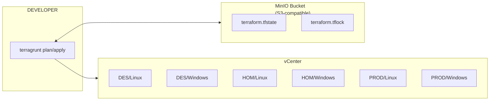
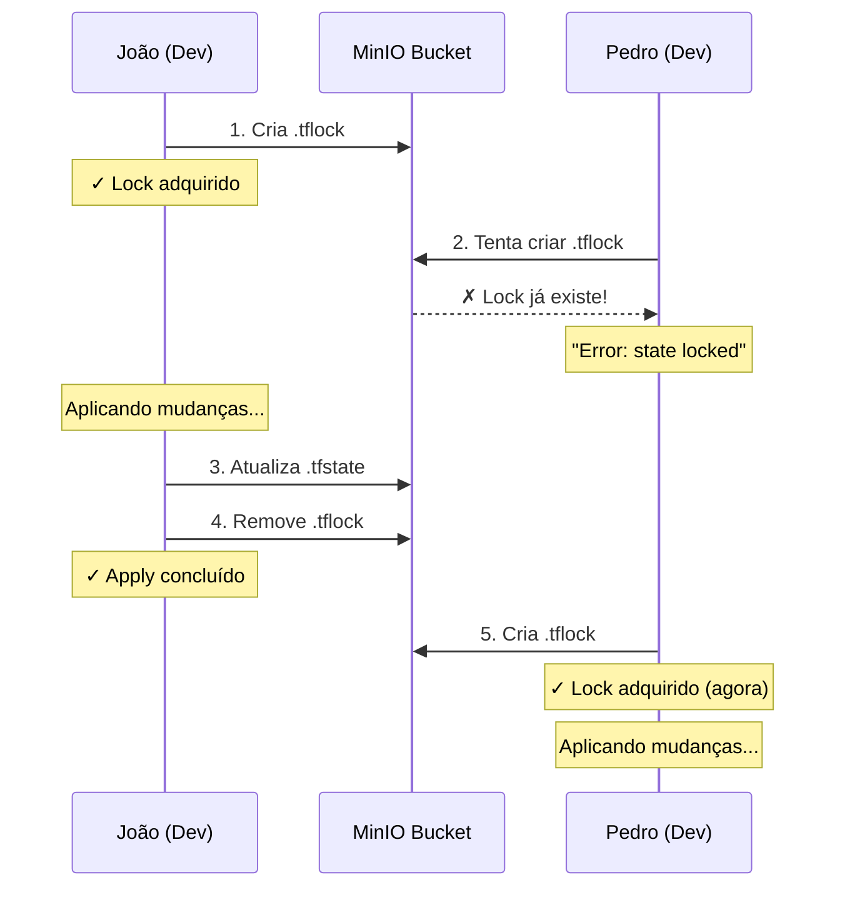

# Guia de Implementacao — Terraform + Terragrunt + vSphere

Provisionamento declarativo de VMs no vCenter.

---

## Indice

1. [Visao Geral da Arquitetura](#1-visao-geral-da-arquitetura)
2. [State Locking + Remote Backend (MinIO)](#2-state-locking--remote-backend-minio)
3. [Estrutura do Repositorio](#3-estrutura-do-repositorio)
4. [Pre-requisitos](#4-pre-requisitos)
5. [Passo 1 — Preparar o MinIO](#5-passo-1--preparar-o-minio)
6. [Passo 2 — Configurar Ambientes vCenter](#6-passo-2--configurar-ambientes-vcenter)
7. [Passo 3 — Provisionar VMs](#7-passo-3--provisionar-vms)
8. [Passo 4 — Testar Localmente](#8-passo-4--testar-localmente)
9. [Gerenciamento de VMs (Day-2 Operations)](#9-gerenciamento-de-vms-day-2-operations)
10. [Referencia de Arquivos](#10-referencia-de-arquivos)
11. [Troubleshooting](#11-troubleshooting)

---

## 1. Visao Geral da Arquitetura



---

## 2. State Locking + Remote Backend (MinIO)

O state e o lock ficam **ambos no storage
S3-compatible** — neste caso, o **MinIO on-prem**. O Terraform usa `use_lockfile`
(>= 1.10) para travar o state via arquivo `.tflock` no mesmo bucket. Sem DynamoDB,
sem AWS, tudo na rede interna.

### Como funciona



### O que acontece no bucket MinIO

Cada stack gera dois arquivos:

```
terraform-vcenter-state/                    (bucket no MinIO)
├── envs/des/linux/
│   ├── terraform.tfstate                   ← estado real da infra
│   └── terraform.tfstate.tflock            ← lock (temporario, durante apply)
├── envs/des/windows/
│   ├── terraform.tfstate
│   └── terraform.tfstate.tflock
├── envs/hom/linux/
│   └── ...
├── envs/hom/windows/
│   └── ...
├── envs/prod/linux/
│   └── ...
└── envs/prod/windows/
    └── ...
```

- O `.tflock` e criado no inicio do `apply` e removido ao final
- Enquanto o `.tflock` existe, qualquer outro `apply` no mesmo stack e **bloqueado**
- Habilitar versionamento no bucket MinIO protege contra corrupcao do state

### Configuracao no Terragrunt (terragrunt.hcl raiz)

```hcl
remote_state {
  backend = "s3"

  generate = {
    path      = "backend.tf"
    if_exists = "overwrite_terragrunt"
  }

  config = {
    bucket = "terraform-vcenter-state"
    key    = "${path_relative_to_include()}/terraform.tfstate"

    endpoints = {
      s3 = "https://minio-des.meudominio.com"    # ← endereco do MinIO (via HAProxy)
    }

    region                      = "us-east-1"   # obrigatorio mas ignorado pelo MinIO
    access_key                  = get_env("MINIO_ACCESS_KEY", "")
    secret_key                  = get_env("MINIO_SECRET_KEY", "")
    skip_credentials_validation = true
    skip_metadata_api_check     = true
    skip_requesting_account_id  = true
    use_path_style              = true           # MinIO usa path-style, nao virtual-hosted
    skip_s3_checksum            = true
    use_lockfile                = true           # lock via .tflock no mesmo bucket
  }
}
```

**Flags essenciais para MinIO:**
- `use_path_style = true` — MinIO usa `https://host/bucket/key` em vez de `https://bucket.host/key`
- `skip_credentials_validation = true` — nao tenta validar credenciais contra a AWS
- `skip_metadata_api_check = true` — nao chama APIs de metadata da AWS
- `skip_requesting_account_id = true` — nao tenta obter account ID da AWS
- `skip_s3_checksum = true` — evita erros de checksum com MinIO
- `use_lockfile = true` — lock file (`.tflock`) armazenado no mesmo bucket MinIO

---

## 3. Estrutura do Repositorio

```
terraform-vcenter/
│
│                                               # Backend: MinIO (bucket criado via mc CLI)
├── modules/
│   ├── vm-linux/                           # Modulo reutilizavel Linux
│   │   ├── versions.tf                     # Terraform >= 1.10, vsphere ~> 2.6
│   │   ├── provider-vars.tf                # vsphere_server, vsphere_user, vsphere_password
│   │   ├── variables.tf                    # datacenter, cluster, template, vms map(object)
│   │   ├── main.tf                         # Locals (datastore resolution)
│   │   ├── vsphere.data.tf                 # Data sources (datacenter, template, rede, pool)
│   │   ├── vsphere.virtual-machine.tf      # Resource vsphere_virtual_machine.this (for_each)
│   │   └── outputs.tf                      # Output: name, ip, uuid, id por VM
│   │
│   └── vm-windows/                         # Modulo reutilizavel Windows (mesma estrutura)
│       ├── versions.tf
│       ├── provider-vars.tf
│       ├── variables.tf
│       ├── main.tf
│       ├── vsphere.data.tf
│       ├── vsphere.virtual-machine.tf
│       └── outputs.tf
│
├── envs/
│   ├── des/                                # Ambiente Desenvolvimento
│   │   ├── env.hcl                         # datacenter, cluster, datastore de DES
│   │   ├── linux/
│   │   │   ├── terragrunt.hcl              # Config (le todos os YAML de vms/)
│   │   │   └── vms/                        # 1 arquivo = 1 VM
│   │   │       ├── app01.yaml
│   │   │       ├── app02.yaml
│   │   │       └── db01.yaml
│   │   └── windows/
│   │       ├── terragrunt.hcl
│   │       └── vms/
│   │           └── web01.yaml
│   ├── hom/                                # Ambiente Homologacao
│   │   ├── env.hcl
│   │   ├── linux/terragrunt.hcl + vms/
│   │   └── windows/terragrunt.hcl + vms/
│   └── prod/                               # Ambiente Producao
│       ├── env.hcl
│       ├── linux/terragrunt.hcl + vms/
│       └── windows/terragrunt.hcl + vms/
│
├── terragrunt.hcl                          # Config raiz (provider vsphere, remote_state S3)
│
├── .gitignore                              # Protege tfvars, tfstate, .env, secrets
└── CLAUDE.md                               # Documentacao do projeto
```

### Naming Conventions

| Elemento | Convencao | Exemplo |
|----------|-----------|---------|
| Arquivos TF | dot-separated por recurso | `vsphere.data.tf`, `s3.bucket.tf` |
| Recursos singleton | `"this"` como nome local | `data.vsphere_datacenter.this` |
| Recursos multiplos | nome descritivo | `data.vsphere_network.this["app01"]` |
| Recursos AWS | kebab-case com prefixo | `magnux-terraform-vcenter-state` |
| VM Linux | hostname lowercase, vCenter uppercase | `des-lnx-app01` / `DES-LNX-APP01` |
| VM Windows | uppercase (max 15 chars NetBIOS) | `DES-WIN-APP01` |
| Outputs | snake_case com sufixo descritivo | `vm_ip`, `vm_uuid` |
| Tags AWS | PascalCase chave, kebab-case valor | `Project = "terraform-vcenter"` |
| State keys | path do stack | `envs/des/linux/terraform.tfstate` |

---

## 4. Pre-requisitos

### Ferramentas locais

```bash
# Terraform >= 1.10 (necessario para use_lockfile)
curl -fsSL https://releases.hashicorp.com/terraform/1.10.5/terraform_1.10.5_linux_amd64.zip -o tf.zip
unzip tf.zip && sudo mv terraform /usr/local/bin/
terraform version
# Terraform v1.10.5

# Terragrunt >= 0.55
curl -sL https://github.com/gruntwork-io/terragrunt/releases/download/v0.55.1/terragrunt_linux_amd64 \
  -o /usr/local/bin/terragrunt
chmod +x /usr/local/bin/terragrunt
terragrunt --version
# terragrunt version v0.55.1

# AWS CLI v2
curl "https://awscli.amazonaws.com/awscli-exe-linux-x86_64.zip" -o awscliv2.zip
unzip awscliv2.zip && sudo ./aws/install
aws --version
```

### Acessos necessarios

| Recurso | Acesso | Para que |
|---------|--------|----------|
| MinIO | Admin (setup inicial) | Criar bucket para state |
| vCenter | Service account com permissoes de VM | Terraform provisionar VMs |

### Service Account no vCenter

Criar um service account dedicado (`svc-terraform@vsphere.local`) com as permissoes:

- `VirtualMachine.*` (criar, clonar, reconfigurar, deletar)
- `Datastore.AllocateSpace`
- `Network.Assign`
- `Resource.AssignVMToPool`
- `Folder.Create` (se usar folders)

---

## 5. Passo 1 — Preparar o MinIO

> Setup unico. Criar o bucket e um service account dedicado no MinIO.

### 5.1 Criar o bucket via mc CLI

```bash
# Configurar alias do MinIO (se ainda nao tiver)
mc alias set minio-des https://minio-des.meudominio.com ADMIN_ACCESS_KEY ADMIN_SECRET_KEY

# Criar o bucket para o state
mc mb minio-des/terraform-vcenter-state

# Habilitar versionamento (protege contra corrupcao do state)
mc version enable minio-des/terraform-vcenter-state

# Verificar
mc ls minio-des/terraform-vcenter-state
```

### 5.2 Criar service account dedicado para Terraform

```bash
# Criar usuario com acesso restrito ao bucket de state
mc admin user add minio-des svc-terraform SenhaForte123!

# Criar policy restrita
cat > /tmp/terraform-state-policy.json << 'EOF'
{
  "Version": "2012-10-17",
  "Statement": [
    {
      "Effect": "Allow",
      "Action": [
        "s3:GetObject",
        "s3:PutObject",
        "s3:DeleteObject",
        "s3:ListBucket",
        "s3:GetBucketVersioning"
      ],
      "Resource": [
        "arn:aws:s3:::terraform-vcenter-state",
        "arn:aws:s3:::terraform-vcenter-state/*"
      ]
    }
  ]
}
EOF

mc admin policy create minio-des terraform-state /tmp/terraform-state-policy.json
mc admin policy attach minio-des terraform-state --user svc-terraform
```

### 5.3 Anotar as credenciais

```
MINIO_ENDPOINT   = https://minio-des.meudominio.com
MINIO_ACCESS_KEY = svc-terraform
MINIO_SECRET_KEY = SenhaForte123!
```

Essas credenciais serao usadas como env vars locais.

### 5.4 Testar a conexao

```bash
export MINIO_ACCESS_KEY="svc-terraform"
export MINIO_SECRET_KEY="SenhaForte123!"
export MINIO_ENDPOINT="https://minio-des.meudominio.com"

# Testar via Terraform
cd envs/des/linux
terragrunt init
# Se conectar ao MinIO e inicializar sem erro, esta funcionando
```

---

## 6. Passo 2 — Configurar Ambientes vCenter

### 6.1 Editar env.hcl de cada ambiente

Substituir os placeholders pelos nomes reais do vCenter:

```hcl
# envs/des/env.hcl
locals {
  environment       = "des"
  datacenter        = "DC-MAGNUX"           # ← nome real do datacenter
  cluster           = "CLUSTER-DES"          # ← nome real do cluster
  datastore_default = "DS-DES-SSD-01"        # ← nome real do datastore
}
```

```hcl
# envs/hom/env.hcl
locals {
  environment       = "hom"
  datacenter        = "DC-MAGNUX"
  cluster           = "CLUSTER-HOM"
  datastore_default = "DS-HOM-SSD-01"
}
```

```hcl
# envs/prod/env.hcl
locals {
  environment       = "prod"
  datacenter        = "DC-MAGNUX"
  cluster           = "CLUSTER-PROD"
  datastore_default = "DS-PROD-SSD-01"
}
```

### 6.2 Editar template_name nos terragrunt.hcl

Em cada stack, ajustar o nome do template que existe no vCenter:

```hcl
# envs/des/linux/terragrunt.hcl
inputs = {
  template_name      = "TMPL-RHEL9-LATEST"     # ← template real
  default_dns_suffix = "des.meudominio.com"
  # ...
}
```

```hcl
# envs/des/windows/terragrunt.hcl
inputs = {
  template_name = "TMPL-WIN2022-LATEST"         # ← template real
  # ...
}
```

### 6.3 Como descobrir os nomes no vCenter

```bash
# Via govc (CLI do vSphere)
export GOVC_URL="vcenter-sef.intranet.ciasc.gov.br"
export GOVC_USERNAME="administrator@vsphere.local"
export GOVC_PASSWORD="senha"
export GOVC_INSECURE=true

govc ls /                          # Datacenters
govc ls /DC-MAGNUX/host/           # Clusters
govc ls /DC-MAGNUX/datastore/      # Datastores
govc ls /DC-MAGNUX/network/        # Portgroups
govc ls /DC-MAGNUX/vm/             # VMs e templates
govc find . -type p                # Resource pools
```

---

## 7. Passo 3 — Provisionar VMs

Cada VM e um **arquivo YAML individual** dentro da pasta `vms/` do ambiente.
O nome do arquivo vira a key no Terraform (ex: `app01.yaml` → `vsphere_virtual_machine.this["app01"]`).

```
envs/des/linux/
├── terragrunt.hcl        # config (le todos os YAML automaticamente)
└── vms/                   # 1 arquivo = 1 VM
    ├── app01.yaml         # DES-LNX-APP01
    ├── app02.yaml         # DES-LNX-APP02
    └── db01.yaml          # DES-LNX-DB01
```

### 7.1 Criar uma VM Linux

Criar o arquivo `envs/des/linux/vms/app01.yaml`:

```yaml
vm_name: DES-LNX-APP01
cpus: 2
memory_mb: 4096
disk_size_gb: 50
portgroup: VLAN-DES-100
ip_address: "10.0.1.10"
netmask: 24
gateway: "10.0.1.1"
dns_servers:
  - "10.0.0.10"
  - "10.0.0.11"
resource_pool: CLUSTER-DES/Resources
folder: DES/Linux
```

### 7.2 Criar uma segunda VM Linux

Criar **outro arquivo** `envs/des/linux/vms/app02.yaml`:

```yaml
vm_name: DES-LNX-APP02
cpus: 4
memory_mb: 8192
disk_size_gb: 80
portgroup: VLAN-DES-100
ip_address: "10.0.1.11"
netmask: 24
gateway: "10.0.1.1"
dns_servers:
  - "10.0.0.10"
  - "10.0.0.11"
resource_pool: CLUSTER-DES/Resources
folder: DES/Linux
```

### 7.3 Criar uma VM Windows

Criar `envs/des/windows/vms/web01.yaml`:

```yaml
vm_name: DES-WIN-WEB01
cpus: 4
memory_mb: 8192
disk_size_gb: 100
portgroup: VLAN-DES-100
ip_address: "10.0.1.20"
netmask: 24
gateway: "10.0.1.1"
dns_servers:
  - "10.0.0.10"
  - "10.0.0.11"
resource_pool: CLUSTER-DES/Resources
folder: DES/Windows
admin_password: SenhaForte!2026
```

### 7.4 VM com disco extra de dados

Criar `envs/des/linux/vms/db01.yaml`:

```yaml
vm_name: DES-LNX-DB01
annotation: PostgreSQL 16
cpus: 8
memory_mb: 32768
disk_size_gb: 100
portgroup: VLAN-DES-DB-200
ip_address: "10.0.2.10"
netmask: 24
gateway: "10.0.2.1"
dns_servers:
  - "10.0.0.10"
  - "10.0.0.11"
resource_pool: CLUSTER-DES/Resources
folder: DES/Linux/Database
extra_disks:
  - label: pgdata
    size_gb: 500
```

### 7.5 Alterar uma VM existente

Para aumentar a RAM da APP01, edite o arquivo `envs/des/linux/vms/app01.yaml`:

```diff
  vm_name: DES-LNX-APP01
  cpus: 2
- memory_mb: 4096
+ memory_mb: 8192
  disk_size_gb: 50
```

O plan mostrara somente a mudanca nessa VM. As outras VMs nao sao afetadas.

### 7.6 Remover uma VM

Deletar o arquivo `vms/app02.yaml`. O Terraform detecta que a VM sumiu do
inventario e a destroi no vCenter. **Revise o plan com cuidado antes de aprovar.**

### 7.7 Campos opcionais por VM

| Campo | Default | Descricao |
|-------|---------|-----------|
| `annotation` | `"Criado via Terraform"` | Nota da VM no vCenter (IP adicionado automaticamente) |
| `folder` | `""` | Pasta no vCenter (ex: `"DES/Linux"`) |
| `datastore` | `""` (usa default do env) | Datastore especifico para esta VM |
| `cpu_hot_add_enabled` | `true` | Permite aumentar CPU sem reboot |
| `memory_hot_add_enabled` | `true` | Permite aumentar RAM sem reboot |
| `extra_disks` | `[]` | Lista de discos adicionais |
| `tags` | `{}` | Tags customizadas |
| **Apenas Windows:** | | |
| `admin_password` | (obrigatorio) | Senha do admin local |
| `full_name` | `"Administrator"` | Nome completo do admin |
| `organization_name` | `"MagnUX"` | Organizacao (Sysprep) |
| `product_key` | `""` | Chave do Windows |
| `workgroup` | `"WORKGROUP"` | Workgroup |
| `time_zone` | `65` | Timezone (65 = E. South America) |

### 7.8 Como o Terragrunt monta o mapa

O `terragrunt.hcl` le todos os YAML automaticamente:

```hcl
locals {
  vm_files = fileset("${get_terragrunt_dir()}/vms", "*.yaml")
  vms = {
    for f in local.vm_files :
    trimsuffix(f, ".yaml") => yamldecode(file("${get_terragrunt_dir()}/vms/${f}"))
  }
}
```

`app01.yaml` + `app02.yaml` + `db01.yaml` viram:

```hcl
vms = {
  "app01" = { vm_name = "DES-LNX-APP01", cpus = 2, ... }
  "app02" = { vm_name = "DES-LNX-APP02", cpus = 4, ... }
  "db01"  = { vm_name = "DES-LNX-DB01",  cpus = 8, ... }
}
```

O nome do arquivo YAML = a key no Terraform = o identificador da VM no state.

---

## 8. Passo 4 — Testar Localmente

### 8.1 Exportar credenciais

```bash
# vCenter
export VSPHERE_SERVER="vcenter-sef.intranet.ciasc.gov.br"
export VSPHERE_USER="svc-terraform@vsphere.local"
export VSPHERE_PASSWORD="senha"

# MinIO (para acessar o remote backend)
export MINIO_ENDPOINT="https://minio-des.meudominio.com"
export MINIO_ACCESS_KEY="svc-terraform"
export MINIO_SECRET_KEY="senha"
```

### 8.2 Plan de um stack especifico

```bash
cd envs/des/linux
terragrunt init     # Conecta ao S3, baixa modulo, cria .terraform/
terragrunt plan     # Mostra o que vai criar/alterar/destruir
```

### 8.3 Apply

```bash
terragrunt apply
# Digitar "yes" para confirmar

# Verificar output:
# vms = {
#   "app01" = {
#     name = "DES-LNX-APP01"
#     ip   = "10.0.1.10"
#     uuid = "4230..."
#     id   = "..."
#   }
# }
```

### 8.4 Comandos uteis

```bash
# Plan/Apply de TODOS os stacks de um ambiente
cd envs/des
terragrunt run-all plan
terragrunt run-all apply

# Plan/Apply de TODOS os ambientes
cd envs
terragrunt run-all plan
terragrunt run-all apply

# Destruir uma VM especifica
cd envs/des/linux
terragrunt destroy -target='module.vm-linux.vsphere_virtual_machine.this["app01"]'

# Ver o state atual
terragrunt state list
terragrunt state show 'vsphere_virtual_machine.this["app01"]'

# Importar uma VM existente
terragrunt import 'vsphere_virtual_machine.this["app01"]' /DC-MAGNUX/vm/DES/Linux/DES-LNX-APP01
```

---

## 9. Gerenciamento de VMs (Day-2 Operations)

Depois que a VM esta provisionada, voce gerencia ela **editando o mesmo bloco `vms`** no
`terragrunt.hcl`. O Terraform detecta a diferenca e aplica somente o que mudou.

### 9.1 Mapa de operacoes: o que e seguro vs. o que destroi

#### ✅ Operacoes Seguras (in-place update)

Nao destroem a VM — aplicam a mudanca direto:

| Operacao | Sintaxe | Risco |
|----------|---------|-------|
| Aumentar CPU | `cpus = 2 → 4` | Baixo |
| Aumentar memoria | `memory_mb = 4096 → 8192` | Baixo |
| Aumentar disco OS | `disk_size_gb = 50 → 100` | Baixo |
| Adicionar disco extra | `extra_disks = [{ label = "data", ... }]` | Baixo |
| Aumentar disco extra | `size_gb = 100 → 200` | Baixo |
| Trocar portgroup | `portgroup = "VLAN-100" → "VLAN-200"` | Medio |
| Mover de folder | `folder = "DES/Linux" → "DES/Linux/Apps"` | Baixo |
| Alterar annotation | `annotation = "novo texto"` | Baixo |
| Mover de resource pool | `resource_pool = "Pool-A" → "Pool-B"` | Baixo |
| Mover de datastore | `datastore = "DS-01" → "DS-02"` | Baixo |

#### ⚠️ Atencao: Reduzir Tamanho

| Operacao | Sintaxe | Risco |
|----------|---------|-------|
| Reduzir CPU | `cpus = 4 → 2` | Requer reboot |
| Reduzir memoria | `memory_mb = 8192 → 4096` | Requer reboot |
| Reduzir disco | `disk_size_gb = 100 → 50` | ❌ IMPOSSIVEL (vSphere nao permite shrink) |

#### ⚠️ Operacoes que Renomeiam (in-place, mas requer cuidado)

| Operacao | Comportamento | Risco |
|----------|---------------|-------|
| Trocar `vm_name` | Renomeia a VM no vCenter (in-place). O hostname interno NAO muda (`ignore_changes` no bloco clone protege contra recreate). Para mudar o hostname interno: SSH + `hostnamectl` | Medio |
| Trocar a key do mapa | `"app01" → "app02"` — Terraform ve como: deletar app01, criar app02. Use `terraform state mv` antes! (ver 9.5) | 💀 DESTROY+CREATE |

#### 💀 Operacao Destrutiva: Remover do Mapa

| Operacao | Comportamento | Risco |
|----------|---------------|-------|
| Remover entry do mapa | Apagar `"app01" = { ... }` — A VM sera **DELETADA** do vCenter. O plan mostrara "destroy". Revise com cuidado. | 💀 DESTROY |

### 9.2 Exemplos praticos de alteracao

Todas as alteracoes sao feitas editando o **arquivo YAML da VM**.

#### Aumentar CPU e memoria (hot-add, sem reboot)

Editar `envs/des/linux/vms/app01.yaml`:

```diff
  vm_name: DES-LNX-APP01
- cpus: 2
- memory_mb: 4096
+ cpus: 4
+ memory_mb: 8192
  disk_size_gb: 50
```

O plan mostrara:

```
~ vsphere_virtual_machine.this["app01"]
    ~ num_cpus: 2 → 4
    ~ memory:   4096 → 8192
```

> Com `cpu_hot_add_enabled = true` e `memory_hot_add_enabled = true` (padrao),
> a mudanca e aplicada **sem desligar a VM**. O SO ve os novos recursos imediatamente.

#### Aumentar disco do sistema operacional

Editar `envs/des/linux/vms/app01.yaml`:

```diff
- disk_size_gb: 50
+ disk_size_gb: 100
```

> O disco e expandido no vCenter. Dentro do SO, voce precisa:
> - **Linux:** `growpart /dev/sda 2 && resize2fs /dev/sda2` (ou `xfs_growfs`)
> - **Windows:** Disk Management > Extend Volume

#### Adicionar um disco extra de dados

Editar `envs/des/linux/vms/db01.yaml`, adicionando no final:

```diff
  folder: DES/Linux/Database
+ extra_disks:
+   - label: data
+     size_gb: 500
```

> O disco e adicionado como `/dev/sdb` (Linux) ou `Disk 1` (Windows).
> Precisa particionar/formatar/montar dentro do SO.

#### Adicionar segundo disco e aumentar o primeiro

```diff
  extra_disks:
    - label: data
-     size_gb: 500
+     size_gb: 750
+   - label: logs
+     size_gb: 200
+     unit_number: 2
```

#### Trocar de VLAN / portgroup

Editar `envs/des/linux/vms/app01.yaml`:

```diff
- portgroup: VLAN-DES-100
+ portgroup: VLAN-DES-200
```

> A interface de rede e reconectada ao novo portgroup. Pode causar breve perda
> de conectividade durante o apply.

#### Mover VM para outra pasta no vCenter

```diff
- folder: DES/Linux
+ folder: DES/Linux/Aplicacoes
```

#### Renomear VM no vCenter (sem recriar)

Editar `envs/des/linux/vms/app01.yaml`:

```diff
- vm_name: DES-LNX-APP01
+ vm_name: DES-LNX-WEBSERVER01
```

> Isso renomeia a VM no vCenter (display name), mas **nao** muda o hostname
> interno do SO (protegido pelo `ignore_changes = [clone]`).
> Para mudar o hostname: `sudo hostnamectl set-hostname novo-nome` via SSH.

### 9.3 Fluxo de trabalho local

```
1. Edita o YAML da VM
   vim envs/des/linux/vms/app01.yaml
   (muda cpus: 2 → 4, memory_mb: 4096 → 8192)

2. Executa o plan para revisar
   cd envs/des/linux
   terragrunt plan
   → Mostra:
     ~ vsphere_virtual_machine.this["app01"]
         ~ num_cpus: 2 → 4
         ~ memory:   4096 → 8192
     Plan: 0 to add, 1 to change, 0 to destroy.

3. Aplica a mudanca
   terragrunt apply
   → VM alterada in-place (hot-add, sem downtime)

4. Commit da alteracao (para versionamento)
   git add envs/des/linux/vms/app01.yaml
   git commit -m "ops: scale up DES-LNX-APP01 (4 CPU, 8GB RAM)"
   git push
```

Para criar uma VM nova, e o mesmo fluxo — so cria um arquivo YAML novo:

```
1. Cria envs/des/linux/vms/app03.yaml
2. terragrunt plan  → mostra: "+ vsphere_virtual_machine.this["app03"]"
3. terragrunt apply → VM criada
4. git add + commit + push (versionamento)
```

### 9.4 Verificar o plan antes de tudo

**REGRA DE OURO:** Sempre leia o plan antes de aplicar.

O plan mostra 3 tipos de acao:

```
Plan: X to add, Y to change, Z to destroy.
```

| Acao | Significado | Risco |
|------|-------------|-------|
| `+` add | Recurso novo sera criado | Baixo |
| `~` change | Recurso existente sera alterado in-place | Medio |
| `-/+` replace | Recurso sera DESTRUIDO e RECRIADO | ALTO |
| `-` destroy | Recurso sera DELETADO | CRITICO |

Se voce vir `destroy` ou `replace` quando nao esperava, **NAO aplique**.
Verifique o que causou e ajuste.

### 9.5 Operacoes especiais via CLI

Algumas operacoes nao podem ser feitas editando o HCL. Use a CLI do Terragrunt/Terraform:

#### Renomear a key no mapa (sem destruir a VM)

Se voce precisa trocar a key `"app01"` para `"webserver01"`:

```bash
cd envs/des/linux

# 1. Mover no state ANTES de editar o HCL
terragrunt state mv \
  'vsphere_virtual_machine.this["app01"]' \
  'vsphere_virtual_machine.this["webserver01"]'

# 2. Agora editar o terragrunt.hcl trocando a key
#    "app01" = { ... }  →  "webserver01" = { ... }

# 3. Plan deve mostrar 0 changes
terragrunt plan
# No changes. Your infrastructure matches the configuration.
```

#### Remover VM do Terraform sem deletar no vCenter

```bash
cd envs/des/linux

# Remove do state (VM continua existindo no vCenter)
terragrunt state rm 'vsphere_virtual_machine.this["app01"]'

# Remover a entry do HCL
# Plan: 0 changes (porque ja nao esta no state)
```

#### Importar VM existente para o Terraform

```bash
cd envs/des/linux

# 1. Adicionar a entry no terragrunt.hcl com os dados da VM

# 2. Importar
terragrunt import \
  'vsphere_virtual_machine.this["app01"]' \
  '/DC-MAGNUX/vm/DES/Linux/DES-LNX-APP01'

# 3. Plan para verificar drift
terragrunt plan
# Ajustar valores no HCL ate o plan mostrar 0 changes
```

### 9.6 Hot-Add: CPU e memoria sem reboot

Os modulos ja vem com hot-add habilitado por padrao:

```hcl
cpu_hot_add_enabled    = true   # padrao
memory_hot_add_enabled = true   # padrao
```

**Requisitos para hot-add funcionar:**

| Requisito | Linux | Windows |
|-----------|-------|---------|
| VMware Tools instalado | Sim | Sim |
| SO suporta hot-add | Kernel 2.6+ (todos modernos) | Server 2012+ |
| VM estava com hot-add ON no boot | Sim (flag no vCenter) | Sim |
| Aumentar CPU | OK sem reboot | OK sem reboot |
| Aumentar memoria | OK sem reboot | OK sem reboot |
| Reduzir CPU | Requer reboot | Requer reboot |
| Reduzir memoria | Requer reboot | Requer reboot |

> Se a VM foi criada SEM hot-add e voce quer habilitar depois,
> precisa desligar a VM, habilitar a flag e religar.

### 9.7 Tabela de referencia rapida

| Quero... | Como fazer | Reboot? | Risco |
|----------|-----------|---------|-------|
| Mais CPU | `cpus = N` | Nao (hot-add) | Baixo |
| Mais RAM | `memory_mb = N` | Nao (hot-add) | Baixo |
| Disco OS maior | `disk_size_gb = N` | Nao (expand no SO) | Baixo |
| Novo disco | `extra_disks = [...]` | Nao (mount no SO) | Baixo |
| Disco extra maior | `size_gb = N` | Nao (expand no SO) | Baixo |
| Trocar VLAN | `portgroup = "X"` | Nao (breve queda) | Medio |
| Mover pasta | `folder = "X"` | Nao | Baixo |
| Renomear vCenter | `vm_name = "X"` | Nao | Baixo |
| Renomear hostname | SSH + hostnamectl | Nao | Manual |
| Trocar IP | Nao faca via TF! | - | Use manual |
| Trocar key do mapa | `state mv` + editar HCL | Nao | Medio |
| Remover VM | Deletar entry do mapa | - | CRITICO |
| Desacoplar VM | `state rm` | Nao | Medio |
| Importar VM | `terragrunt import` | Nao | Medio |

## 10. Referencia de Arquivos

### terragrunt.hcl (raiz)

```hcl
locals {
  env_vars    = read_terragrunt_config(find_in_parent_folders("env.hcl"))
  environment = local.env_vars.locals.environment

  minio_endpoint = get_env("MINIO_ENDPOINT", "https://minio-des.meudominio.com")
  minio_bucket   = "terraform-vcenter-state"
}

generate "provider" {
  path      = "provider.tf"
  if_exists = "overwrite_terragrunt"
  contents  = <<-EOF
    provider "vsphere" {
      vsphere_server       = var.vsphere_server
      user                 = var.vsphere_user
      password             = var.vsphere_password
      allow_unverified_ssl = true
    }
  EOF
}

remote_state {
  backend = "s3"

  generate = {
    path      = "backend.tf"
    if_exists = "overwrite_terragrunt"
  }

  config = {
    bucket = local.minio_bucket
    key    = "${path_relative_to_include()}/terraform.tfstate"

    endpoints = {
      s3 = local.minio_endpoint
    }

    region                      = "us-east-1"
    access_key                  = get_env("MINIO_ACCESS_KEY", "")
    secret_key                  = get_env("MINIO_SECRET_KEY", "")
    skip_credentials_validation = true
    skip_metadata_api_check     = true
    skip_requesting_account_id  = true
    use_path_style              = true
    skip_s3_checksum            = true
    use_lockfile                = true
  }
}

inputs = {
  vsphere_server   = get_env("VSPHERE_SERVER", "")
  vsphere_user     = get_env("VSPHERE_USER", "")
  vsphere_password = get_env("VSPHERE_PASSWORD", "")
}
```

### envs/{env}/env.hcl

```hcl
locals {
  environment       = "des"          # des | hom | prod
  datacenter        = "DC-MAGNUX"
  cluster           = "CLUSTER-DES"
  datastore_default = "DS-DES-SSD-01"
}
```

### envs/{env}/{os}/terragrunt.hcl

```hcl
include "root" {
  path = find_in_parent_folders()
}

locals {
  env_vars = read_terragrunt_config(find_in_parent_folders("env.hcl"))

  # Le todos os YAML de vms/ e monta o mapa automaticamente
  vm_files = fileset("${get_terragrunt_dir()}/vms", "*.yaml")
  vms = {
    for f in local.vm_files :
    trimsuffix(f, ".yaml") => yamldecode(file("${get_terragrunt_dir()}/vms/${f}"))
  }
}

terraform {
  source = "${get_terragrunt_dir()}/../../../modules/vm-linux"
}

inputs = {
  datacenter         = local.env_vars.locals.datacenter
  cluster            = local.env_vars.locals.cluster
  datastore_default  = local.env_vars.locals.datastore_default
  template_name      = "TMPL-RHEL9-LATEST"
  default_dns_suffix = "des.meudominio.com"

  vms = local.vms
}
```

### envs/{env}/{os}/vms/{nome}.yaml

```yaml
# Cada arquivo YAML = 1 VM. O nome do arquivo = key no Terraform.
vm_name: DES-LNX-APP01
cpus: 2
memory_mb: 4096
disk_size_gb: 50
portgroup: VLAN-DES-100
ip_address: "10.0.1.10"
netmask: 24
gateway: "10.0.1.1"
dns_servers:
  - "10.0.0.10"
  - "10.0.0.11"
resource_pool: CLUSTER-DES/Resources
folder: DES/Linux
```

---

## 11. Troubleshooting

### State lock preso

Se um apply falhar no meio e o `.tflock` nao for removido:

```bash
# Ver quem segura o lock
terragrunt force-unlock LOCK_ID

# O LOCK_ID aparece na mensagem de erro:
# "Error locking state: Lock ID: xxxxxxxx-xxxx-..."
```

### Backend MinIO nao encontrado

```bash
# Verificar se o bucket existe
mc ls minio-des/terraform-vcenter-state

# Verificar se o MinIO esta acessivel
curl -s https://minio-des.meudominio.com/minio/health/live

# Testar credenciais
mc alias set test https://minio-des.meudominio.com svc-terraform SENHA
mc ls test/terraform-vcenter-state
```

### MinIO connection refused

Verificar:
1. Sua maquina tem acesso de rede ao MinIO (`curl https://minio-des.meudominio.com/minio/health/live`)
2. As env vars `MINIO_ENDPOINT`, `MINIO_ACCESS_KEY`, `MINIO_SECRET_KEY` estao configuradas
3. O endpoint deve incluir o schema (`https://minio-des.meudominio.com`)
4. O certificado CA interno (`sef-RADIUS-CA-1.crt`) deve estar no trust store do sistema

### Template nao encontrado no vCenter

```bash
# Listar templates disponiveis
govc find /DC-MAGNUX -type m | grep -i template

# Verificar nome exato (case-sensitive)
govc vm.info /DC-MAGNUX/vm/TMPL-RHEL9-LATEST
```

### VM criada mas sem IP

A customizacao de rede depende do VMware Tools estar instalado no template.
Verificar que o template tem:
- `open-vm-tools` instalado (Linux)
- `VMware Tools` instalado (Windows)
- Perl instalado (Linux, necessario para guest customization)

---

> **Ordem de deploy:**
> MinIO bucket (uma vez) → configurar vCenter → `envs/des/*` → `envs/hom/*` → `envs/prod/*`
>
> **Ordem de destruicao (se necessario):**
> `envs/prod/*` → `envs/hom/*` → `envs/des/*` → MinIO bucket (por ultimo, se necessario)
